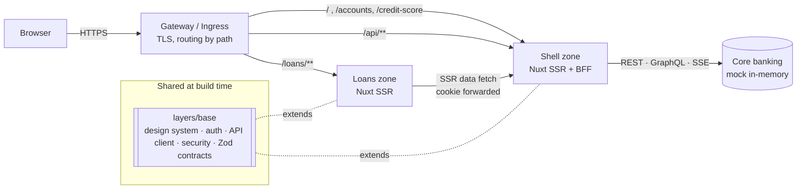

# Banking Portal — Nuxt micro-frontend reference app

A production-style internet-banking portal: dashboards with real-time loan status, credit scoring and
cash-flow analytics, account transactions, and a multi-step loan application. It is built as **two
independently deployable Nuxt zones** that share one platform layer, and sit behind a small
**Backend-for-Frontend (BFF)** that exposes REST, GraphQL and Server-Sent Events.

> Demo login: **demo@bank.test** / **Password123!** — all data is fictitious and in-memory.

```bash
nvm use            # Node 22 (>= 22.19)
pnpm install
pnpm dev           # http://localhost:3000  (shell :3000 + loans zone :3001, proxied under /loans)
```

---

## What's inside

| Area                 | Highlights                                                                                                                                                                            |
| -------------------- | ------------------------------------------------------------------------------------------------------------------------------------------------------------------------------------- |
| **Dashboard**        | KPI tiles, cash-flow bar chart, credit-score gauge, live loan pipeline — one GraphQL round trip plus REST, server-rendered then hydrated                                              |
| **Real time**        | SSE stream of loan status changes patches the TanStack Query cache in place, highlights the row and announces it to screen readers                                                    |
| **Accounts**         | Masked account numbers, paginated/filterable transactions with filters stored in the URL, `keepPreviousData` for jank-free paging                                                     |
| **Credit score**     | 12-month trend, score factors, accessible data-table fallback for every chart                                                                                                         |
| **Loan application** | 4-step wizard: VeeValidate + Zod per step, cross-field affordability (debt-to-income) rule, draft saved to `sessionStorage` **without PII**, server re-validates with the same schema |
| **Loan detail**      | Status timeline, amortization schedule, _withdraw_ with an optimistic update + rollback                                                                                               |
| **Session security** | httpOnly sealed session cookie, CSRF double-submit + Origin check, idle timeout with warning dialog, open-redirect protection                                                         |

## Architecture



- **Zones (micro-frontends).** `apps/shell` owns `/`, accounts, credit score and the BFF; `apps/loans`
  owns everything under `/loans` (`app.baseURL: '/loans/'`). Each zone builds, tests and deploys on its own.
  Links inside a zone are client-side; links across zones are full page loads (`<ZoneLink>`) — the same
  model as **Next.js multi-zones**. See [ADR 0001](docs/adr/0001-micro-frontends-with-nuxt-zones.md).
- **Platform layer.** `layers/base` is a [Nuxt layer](https://nuxt.com/docs/getting-started/layers): UI kit,
  form components, auth guard, Pinia stores, API client, TanStack Query setup, CSP/headers, and the
  **shared Zod contracts** (`#contracts`) used by the forms _and_ the server.
- **Routing between zones.** Kubernetes: Gateway API `HTTPRoute` by path prefix. Locally/Compose: the shell
  proxies `/loans/**` (Vite proxy in dev, Nitro middleware in production builds).
- **State.** Server state → TanStack Query (SSR-dehydrated into the Nuxt payload). Client state → Pinia.
  Form state → VeeValidate. URL state → route query. See [ADR 0002](docs/adr/0002-state-management.md).

## Job requirements → where they live

The role is described in React terms; this project uses the direct Nuxt/Vue equivalents.

| Requirement           | React ecosystem              | Here                                                                                                                             | Look at                                                                 |
| --------------------- | ---------------------------- | -------------------------------------------------------------------------------------------------------------------------------- | ----------------------------------------------------------------------- |
| TypeScript (strict)   | TS                           | TS strict, typed API/contracts, `vue-tsc` in CI                                                                                  | `layers/base/shared/contracts/`                                         |
| Framework / SSR       | React + Next.js              | Vue 3 + **Nuxt 4** (SSR, file routing, Nitro server)                                                                             | `apps/*/app/pages/`                                                     |
| Micro-frontends       | Next.js multi-zones          | **Nuxt zones** + shared **Nuxt layer**                                                                                           | `apps/loans/nuxt.config.ts`, `ZoneLink.vue`                             |
| Client state          | Zustand / Redux Toolkit      | **Pinia** (setup stores)                                                                                                         | `layers/base/app/stores/`, `apps/loans/app/stores/`                     |
| Server state          | TanStack Query               | **TanStack Query (Vue)** with SSR hydration, query-key factory, optimistic updates                                               | `plugins/02.vue-query.ts`, `utils/query-keys.ts`, `useLoanMutations.ts` |
| Forms + validation    | React Hook Form + Zod        | **VeeValidate + Zod** (custom Zod 4 resolver)                                                                                    | `utils/zod-typed-schema.ts`, `components/form/`                         |
| REST + GraphQL        | fetch/axios, Apollo/urql     | `$fetch` client + GraphQL over HTTP (`graphql-js`), depth limit, no introspection in prod                                        | `plugins/01.api.ts`, `server/api/graphql.ts`                            |
| Real-time dashboards  | SSE/WebSocket + charts       | **SSE** + Chart.js (code-split, client-only)                                                                                     | `server/api/stream/loans.get.ts`, `useLoanStream.ts`                    |
| XSS / CSRF / security | —                            | CSP with nonces + SRI, `no-v-html`, CSRF double-submit + Origin check, sealed httpOnly cookies, rate limiting, IDOR-safe lookups | [Security](#security)                                                   |
| Accessibility         | —                            | WCAG 2.2 AA: axe in E2E, error summary, live regions, focus management, native `<dialog>`                                        | [Accessibility](#accessibility)                                         |
| Performance           | —                            | SSR + hydration without double fetch, lazy chart chunks, tree-shaken Chart.js, compressed assets                                 | [Performance](#performance)                                             |
| Tooling               | Vite, pnpm, ESLint, Prettier | Vite 8 (Rolldown), pnpm workspaces, ESLint flat config, Prettier                                                                 | root configs                                                            |
| Testing               | Jest/Vitest, RTL, Playwright | **Vitest** (unit + Nuxt runtime), **@vue/test-utils**, **Playwright** + **axe**                                                  | `**/test/`, `e2e/`                                                      |
| Git / PRs             | —                            | Conventional Commits hook, lint-staged, PR template, code review checklist                                                       | [CONTRIBUTING.md](CONTRIBUTING.md)                                      |
| CI/CD                 | —                            | GitHub Actions: quality → E2E → image build + Trivy scan → staging → gated production                                            | `.github/workflows/`                                                    |
| Docker & Kubernetes   | —                            | Multi-stage non-root image, Compose, Kustomize base/overlays, HPA, PDB, NetworkPolicy, Gateway API                               | `Dockerfile`, `k8s/`                                                    |

## Project structure

```
apps/
  shell/                 # zone "/" — dashboard, accounts, credit score, login + the BFF
    app/                 #   pages, components, composables (Vue)
    server/              #   Nitro: REST api/, GraphQL, SSE, session, CSRF verify, zone proxy
    test/                #   unit (node) + nuxt (component) tests
  loans/                 # zone "/loans" — list, detail, application wizard
layers/
  base/                  # shared platform layer (extended by every zone)
    app/                 #   UI kit, form fields, layouts, auth middleware, stores, plugins
    server/              #   CSRF cookie issuer, /healthz
    shared/contracts/    #   Zod schemas + types shared by client and server (#contracts)
e2e/                     # Playwright journeys + axe accessibility checks
k8s/                     # Kustomize base + staging/production overlays
docs/adr/                # Architecture decision records
```

## Scripts

| Command                                        | What it does                                                                   |
| ---------------------------------------------- | ------------------------------------------------------------------------------ |
| `pnpm dev`                                     | Both zones with HMR; open http://localhost:3000                                |
| `pnpm build` / `pnpm preview`                  | Production builds / run them together locally                                  |
| `pnpm lint` · `pnpm format` · `pnpm typecheck` | ESLint (incl. a11y + security rules) · Prettier · `vue-tsc`                    |
| `pnpm test` · `pnpm test:coverage`             | Vitest across all packages                                                     |
| `pnpm test:e2e`                                | Playwright on the production builds, desktop + mobile (run `pnpm build` first) |
| `pnpm docker:up`                               | Production images via Docker Compose (needs `.env`, see `.env.example`)        |

## Mock data

All demo data lives in [`apps/shell/server/data/mock-data.json`](apps/shell/server/data/mock-data.json):
users, accounts, transactions, loans and credit scores. Edit it and restart the shell to change the demo.

- Amounts are integer **minor units** (cents), e.g. `{ "amount": 1284550, "currency": "USD" }` is $12,845.50.
- On startup every timestamp is shifted by the time elapsed since `snapshotAt`, so the newest data is always
  "today" and the 6-month charts never go empty.
- Full account numbers stay on the server; the API only returns masked numbers.
- The demo password is stored as a salted scrypt hash (`passwordSalt` / `passwordHash`).

## Security

| Threat                            | Mitigation                                                                                                                                                                                                                           |
| --------------------------------- | ------------------------------------------------------------------------------------------------------------------------------------------------------------------------------------------------------------------------------------ |
| XSS                               | Vue auto-escaping; `vue/no-v-html` is an error; strict CSP (`script-src 'strict-dynamic' 'nonce-…'`, `object-src 'none'`, `base-uri 'none'`, `frame-ancestors 'none'`); SRI on every script; `nuxt-security` XSS validator on inputs |
| CSRF                              | SameSite cookies **+** double-submit token (`XSRF-TOKEN` cookie ↔ `x-csrf-token` header, constant-time compare) **+** Origin check on all unsafe methods; GraphQL queries use GET, mutations require POST                            |
| Session theft                     | Session is an iron-sealed **httpOnly**, `Secure`, `SameSite=Lax` cookie; header-based sessions disabled; sliding 30-minute expiry; client idle timeout with warning                                                                  |
| Credential stuffing / enumeration | 10 logins/min per IP; identical error for unknown email vs wrong password; constant-time hash compare against a dummy hash                                                                                                           |
| IDOR                              | Every lookup is scoped to the session user; unknown or foreign IDs return 404                                                                                                                                                        |
| Open redirect                     | `safeRedirect()` only allows same-origin absolute paths (unit-tested against `//`, `/\`, schemes, control chars)                                                                                                                     |
| Data exposure                     | Only masked account numbers leave the server; national ID/DOB never written to browser storage; forms use `method="post"` so pre-hydration submits can't leak into URLs; production errors don't leak internals                      |
| Abuse                             | Request size limits, rate limiting, GraphQL depth limit, introspection disabled in production                                                                                                                                        |
| Supply chain / runtime            | Lockfile + `--frozen-lockfile`, Dependabot, Trivy image scan, non-root read-only container, Pod Security `restricted`, default-deny NetworkPolicy                                                                                    |

## Accessibility

Targeting **WCAG 2.2 AA**, enforced by `eslint-plugin-vuejs-accessibility` and **axe in every E2E journey**:
skip link and landmarks · route announcer and `aria-live` updates for real-time events · GOV.UK-style error
summary that receives focus and links to fields · `aria-invalid` / `aria-describedby` on every input ·
focus moves to the step heading in the wizard · native `<dialog>` for modals · status is never conveyed by
colour alone · charts have text alternatives and data tables · `prefers-reduced-motion` and dark mode.

## Performance

SSR with TanStack Query dehydration (no double fetch on hydrate) · Chart.js is tree-shaken and loaded as a
lazy client-only chunk · route-level code splitting per zone · `keepPreviousData` on paginated queries ·
query `staleTime` tuned per resource · compressed static assets with immutable caching · minimal runtime
image (~240 MB, only Nitro's traced dependencies).

## Testing

| Layer     | Tooling                                         | Examples                                                                                                                       |
| --------- | ----------------------------------------------- | ------------------------------------------------------------------------------------------------------------------------------ |
| Unit      | Vitest (node)                                   | Zod contracts (affordability, age, phone), amortization maths, formatters, CSRF tokens, safe redirects, mock-bank IDOR scoping |
| Component | Vitest + `@nuxt/test-utils` + `@vue/test-utils` | accessible field wiring, pagination, status badge, wizard conditional fields, PII-free draft persistence                       |
| E2E       | Playwright (desktop + Pixel 7) + axe            | login + redirect, open-redirect guard, dashboard, URL filters, 404s, full wizard with DTI rejection, optimistic withdraw       |

## Deployment

```bash
cp .env.example .env && pnpm docker:up          # production images locally
kubectl kustomize k8s/overlays/staging          # render manifests
```

`deploy.yml` builds both images with SBOM + provenance, deploys `main` to **staging** automatically, and a
`v*.*.*` tag to **production** behind a protected environment (manual approval).

## Production notes

This is a reference implementation; a real deployment would also:

- replace the mock bank and password login with the core-banking APIs and an OIDC identity provider (PKCE, MFA/step-up for payments);
- publish loan events through Redis/Kafka so every BFF replica receives them (the in-process pub/sub is single-replica);
- add observability (OpenTelemetry traces, RUM/Web Vitals, error tracking with PII scrubbing) and feature flags;
- serve static assets from a CDN and pin base images and actions by digest.
